# Bunshare プロジェクト依存関係図

このドキュメントは、Bunshareプロジェクトの主要な依存関係をMermaid図で可視化したものです。
Ctrl + Shift + Vでプレビューを見ることができます。

---

## 目次

1. [全体アーキテクチャ](#1-全体アーキテクチャ)
2. [共通インフラストラクチャ](#2-共通インフラストラクチャ)
3. [ホームページ](#3-ホームページ)
4. [作品詳細ページ](#4-作品詳細ページ)
5. [検索ページ](#5-検索ページ)
6. [ユーザープロフィールページ](#6-ユーザープロフィールページ)
7. [投稿ページ](#7-投稿ページ)
8. [トレンドページ](#8-トレンドページ)
9. [認証ページ](#9-認証ページ)
10. [Feature内部構造](#10-feature内部構造)
11. [図の見方](#図の見方)
12. [開発時の注意点](#開発時の注意点)

---

## 1. 全体アーキテクチャ

### 1.1 レイヤー構造

Bunshareは以下の階層構造で構成されています：
- **Pages** (`app/`): Next.js App Routerページ
- **Features** (`features/`): ドメインごとの機能境界
- **Components** (`components/`): 共通UI部品
- **Lib** (`lib/`): 共通ロジック・ユーティリティ

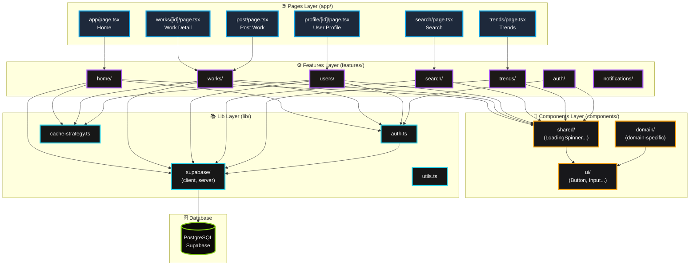

### 1.2 データフロー（RSC + Server Actions）

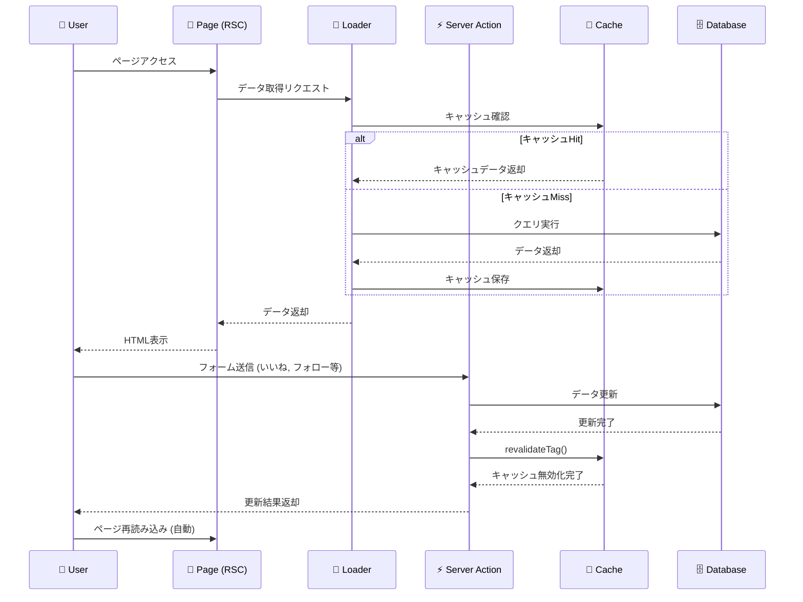

---

## 2. 共通インフラストラクチャ

### 2.1 認証システム（lib/auth.ts）

認証処理の全体フロー

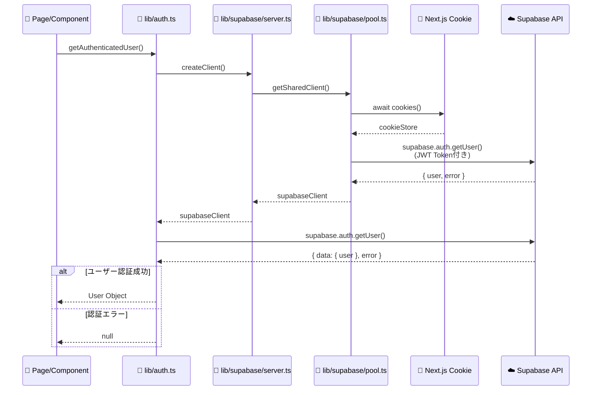

**主要関数:**
- `getAuthenticatedUser()`: 基本認証確認（lib/auth.ts:6）
- `getPostUserProfile()`: プロフィール付き認証（lib/auth.ts:58）

### 2.2 Supabase接続（@supabase/ssr）

#### 接続フロー全体図

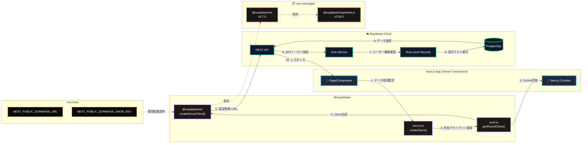

#### 詳細シーケンス

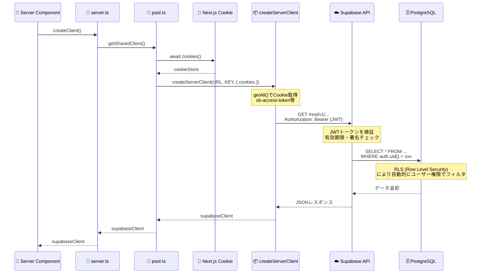

**主要ファイル:**
- `lib/supabase/server.ts`: クライアント作成エントリポイント
- `lib/supabase/pool.ts`: 共有クライアントプール（パフォーマンス最適化）
- `lib/supabase/client.ts`: ブラウザ用クライアント

**接続先情報（.env.local）:**
```
NEXT_PUBLIC_SUPABASE_URL=https://auemhlvikaveglwxordt.supabase.co
NEXT_PUBLIC_SUPABASE_ANON_KEY=eyJhbGci...（JWTトークン）
```

**重要ポイント:**
1. **Supabase特有**: 汎用HTTPクライアントではなく、Supabase専用
2. **Cookie自動管理**: Next.jsのCookieから認証情報を自動取得
3. **RLS連携**: JWTトークンでユーザー権限が自動判定される
4. **SSR対応**: Server ComponentsでCookieを正しく扱うための設計

### 2.3 ユーティリティ（lib/utils）

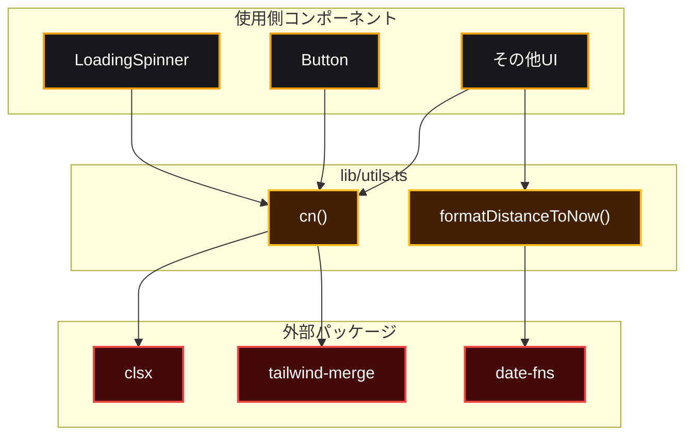

**主要関数:**
- `cn()`: Tailwindクラスのマージユーティリティ
- `formatDistanceToNow()`: 相対時間表示

---

## 3. ホームページ

**ファイルパス:** `app/app/page.tsx`

### 3.1 全体構造

ホームページは以下の5つのSuspenseコンポーネントで構成されています。

```mermaid
graph TD
    %% === ページファイル ===
    subgraph PAGE["app/app/page.tsx"]
        HOMEPAGE["HomePage()"]
    end

    %% === 認証ファイル ===
    subgraph AUTH_FILE["lib/auth.ts"]
        GET_AUTH_USER["getAuthenticatedUser()"]
    end

    %% === Suspense Components ===
    subgraph CONTINUE_FILE["ContinueReadingSuspense.tsx"]
        CONTINUE_READ["ContinueReadingSuspense()"]
    end

    subgraph POSTGRES_FILE["PostgreSQLRecommendationsSuspense.tsx"]
        POSTGRES_REC["PostgreSQLRecommendationsSuspense()"]
    end

    subgraph NOVELS_FILE["NovelsSuspense.tsx"]
        NOVELS["NovelsSuspense()"]
    end

    subgraph ESSAYS_FILE["EssaysSuspense.tsx"]
        ESSAYS["EssaysSuspense()"]
    end

    subgraph TAGS_FILE["UserTagsSuspense.tsx"]
        USER_TAGS["UserTagsSuspense()"]
    end

    %% === React ===
    subgraph REACT["react"]
        SUSPENSE["Suspense"]
    end

    %% === 依存関係 ===
    HOMEPAGE --> GET_AUTH_USER
    HOMEPAGE --> SUSPENSE
    HOMEPAGE --> CONTINUE_READ
    HOMEPAGE --> POSTGRES_REC
    HOMEPAGE --> NOVELS
    HOMEPAGE --> ESSAYS
    HOMEPAGE --> USER_TAGS

    %% === スタイル ===
    classDef page fill:#1e293b,stroke:#0ea5e9,stroke-width:3px,color:#fff
    classDef auth fill:#0f172a,stroke:#10b981,stroke-width:2px,color:#fff
    classDef feature fill:#1c1917,stroke:#a855f7,stroke-width:2px,color:#fff
    classDef npm fill:#450a0a,stroke:#ef4444,stroke-width:2px,color:#fff

    class HOMEPAGE page
    class GET_AUTH_USER auth
    class CONTINUE_READ,POSTGRES_REC,NOVELS,ESSAYS,USER_TAGS feature
    class SUSPENSE npm
```

---

### 3.2 ContinueReadingSuspense

**機能:** ユーザーが途中まで読んだ作品を表示

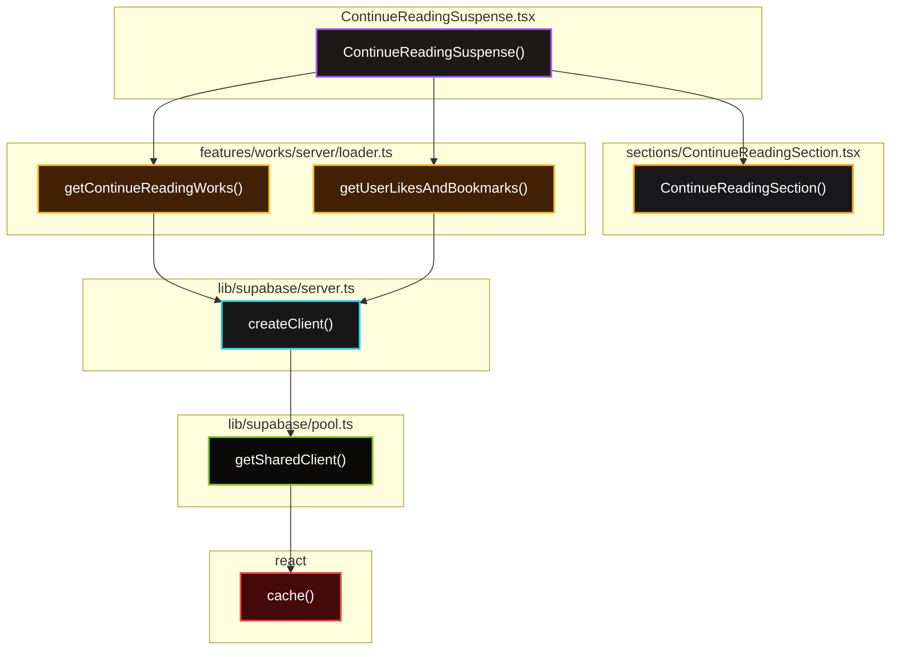

**データフロー:**
1. `getContinueReadingWorks()`: 読書進捗がある作品を取得
2. `getUserLikesAndBookmarks()`: ユーザーのいいね・ブックマーク状態を取得
3. `ContinueReadingSection`: 取得したデータをUIに渡す

---

### 3.3 PostgreSQLRecommendationsSuspense

**機能:** PostgreSQL推薦システムによるパーソナライズ推薦

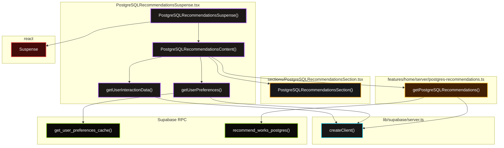

**データフロー:**
1. `getUserInteractionData()`: いいね・ブックマーク・読書進捗を並列取得
2. `getUserPreferences()`: ユーザーの嗜好（カテゴリ・タグ）をRPCで取得
3. `getPostgreSQLRecommendations()`: PostgreSQL推薦RPCを実行
4. 動的タイトル生成: 嗜好データがあれば「あなたの好み」、なければ「あなたへのおすすめ」

---

### 3.4 UserTagsSuspense

**機能:** ユーザーの行動履歴に基づくタグ推薦

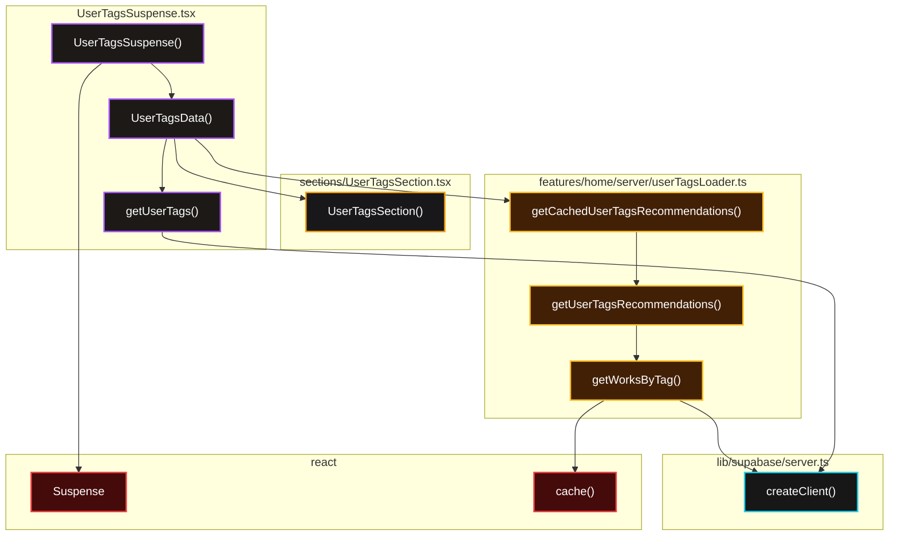

**データフロー:**
1. `getUserTags()`: ユーザーのいいね・ブックマーク・進捗を取得
2. `getCachedUserTagsRecommendations()`: タグベース推薦（キャッシュ付き）
3. `getUserTagsRecommendations()`: ユーザーの行動からタグを抽出し、各タグで作品を取得
4. `getWorksByTag()`: 各タグごとに作品を取得（`cache()`でメモ化）

---

### 3.5 NovelsSuspense

**機能:** 小説カテゴリの作品一覧

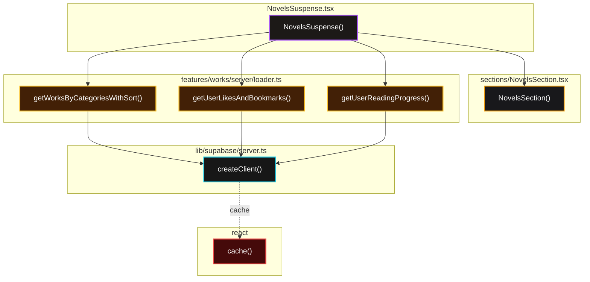

**データフロー:**
1. `getWorksByCategoriesWithSort(['小説'], 'views', 9)`: 小説を閲覧数順で9件取得
2. ユーザーがいる場合: いいね・ブックマーク・進捗を並列取得
3. `NovelsSection`: UIに渡す

---

### 3.6 EssaysSuspense

**機能:** エッセイカテゴリの作品一覧

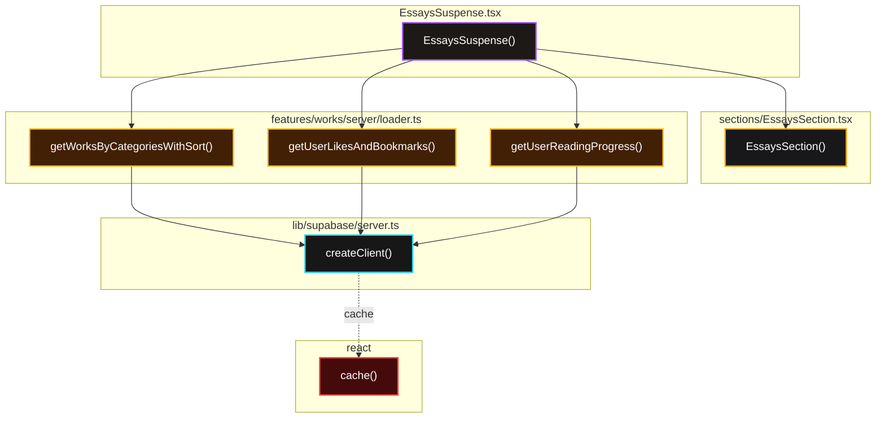

**データフロー:**
1. `getWorksByCategoriesWithSort(['エッセイ'], 'views', 9)`: エッセイを閲覧数順で9件取得
2. ユーザーがいる場合: いいね・ブックマーク・進捗を並列取得
3. `EssaysSection`: UIに渡す

---

### 3.7 認証フロー

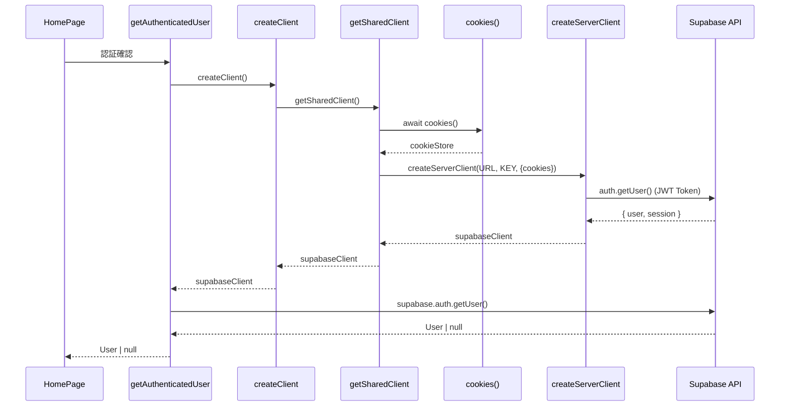

**フロー詳細:**
1. `HomePage()` → `getAuthenticatedUser()`: 認証確認
2. `createClient()` → `getSharedClient()`: 共有クライアント取得（`cache()`でメモ化）
3. `cookies()`: Next.jsからCookieを取得
4. `createServerClient()`: Supabase SSRクライアント作成（JWT Token付き）
5. `auth.getUser()`: Supabase APIで認証確認
6. 返り値: `User | null`

---

### 3.8 UI依存関係

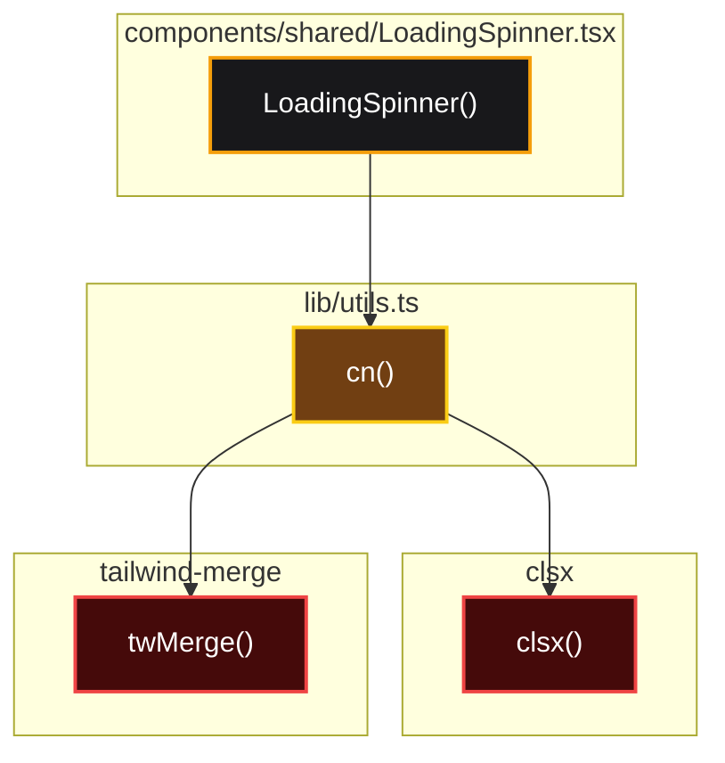

**関数:**
- `cn()`: Tailwind CSSクラスのマージユーティリティ
  - `clsx()`: 条件付きクラス結合
  - `twMerge()`: Tailwindクラスの競合解決

---

## 4. 作品詳細ページ

**ファイルパス:** `app/app/works/[id]/page.tsx`

### 4.1 全体構造（関数レベル）

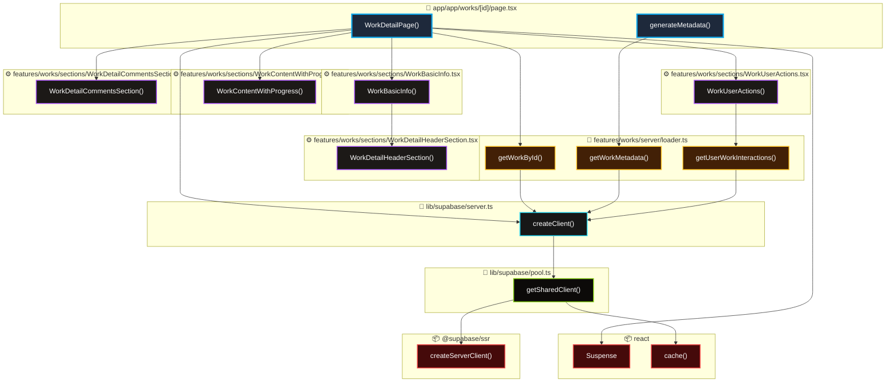

### 4.2 データローダー詳細

**features/works/server/loader.ts** の主要関数：

```mermaid
graph TD
    subgraph "features/works/server/loader.ts"
        GET_WORKS["getWorks()"]
        GET_WORKS_BY_CAT["getWorksByCategory()"]
        GET_WORKS_WITH_SORT["getWorksByCategoriesWithSort()"]
        GET_LIKES["getUserLikesAndBookmarks()"]
        GET_PROGRESS["getUserReadingProgress()"]
        GET_CONTINUE["getContinueReadingWorks()"]
        GET_HISTORY["getUserReadingHistory()"]
        CREATE_CACHE["createCachedWorkData()"]
        GET_BY_ID["getWorkById()"]
        GET_INTERACTIONS["getUserWorkInteractions()"]
        GET_METADATA["getWorkMetadata()"]
    end

    subgraph "lib/supabase/"
        CLIENT["createClient()"]
    end

    %% === 依存関係 ===
    GET_WORKS --> CLIENT
    GET_WORKS_BY_CAT --> CLIENT
    GET_WORKS_WITH_SORT --> CLIENT
    GET_LIKES --> CLIENT
    GET_PROGRESS --> CLIENT
    GET_CONTINUE --> CLIENT
    GET_HISTORY --> CLIENT
    CREATE_CACHE --> CLIENT
    GET_BY_ID --> CLIENT
    GET_INTERACTIONS --> CLIENT
    GET_METADATA --> CLIENT

    %% === スタイル ===
    classDef loader fill:#0c0a09,stroke:#84cc16,stroke-width:2px,color:#fff
    classDef lib fill:#171717,stroke:#22d3ee,stroke-width:2px,color:#fff

    class GET_WORKS,GET_WORKS_BY_CAT,GET_WORKS_WITH_SORT,GET_LIKES,GET_PROGRESS,GET_CONTINUE,GET_HISTORY,CREATE_CACHE,GET_BY_ID,GET_INTERACTIONS,GET_METADATA loader
    class CLIENT lib
```

---

## 5. 検索ページ

**ファイルパス:** `app/app/search/page.tsx`

### 5.1 全体構造

検索ページは3つのSectionで構成されています。

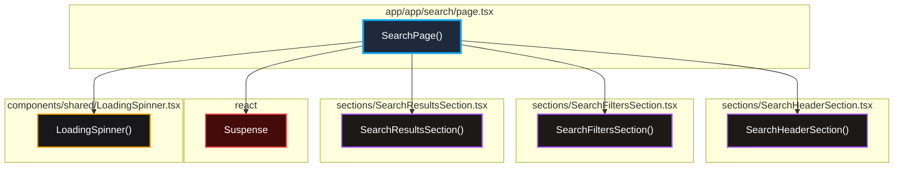

**主要機能:**
- クエリパラメータベースの検索（`?q=keyword&category=小説&sort=views`）
- 作品・ユーザー両方の検索結果を表示
- フィルター機能（カテゴリ、並び順、タイプ）
- ページネーション

---

### 5.2 SearchResultsSection

**機能:** 検索結果の取得と表示

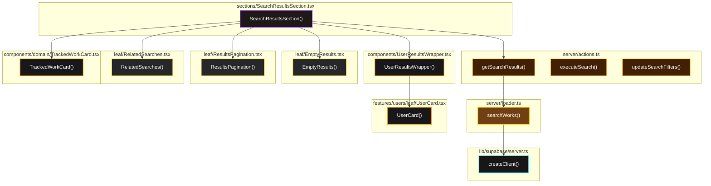

**データフロー:**
1. `getSearchResults(query, filters, page)`: 検索リクエスト
2. `searchWorks()`: 作品検索をSupabaseで実行
3. 結果を以下に分配:
   - 作者: `UserResultsWrapper` → `UserCard`
   - 作品: `TrackedWorkCard`（クリック追跡機能付き）
   - 空結果: `EmptyResults`
   - 関連検索: `RelatedSearches`
4. ページネーション: `ResultsPagination`

---

### 5.3 SearchFiltersSection

**機能:** フィルター選択UI

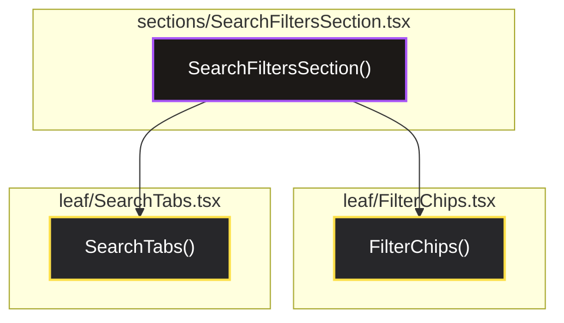

**フィルター項目:**
- **カテゴリ**: 全て / 小説 / エッセイ / 詩
- **並び順**: 関連度 / 閲覧数 / いいね数 / 新着順
- **タイプ**: 全て / 作品のみ / ユーザーのみ

---

### 5.4 検索データフロー

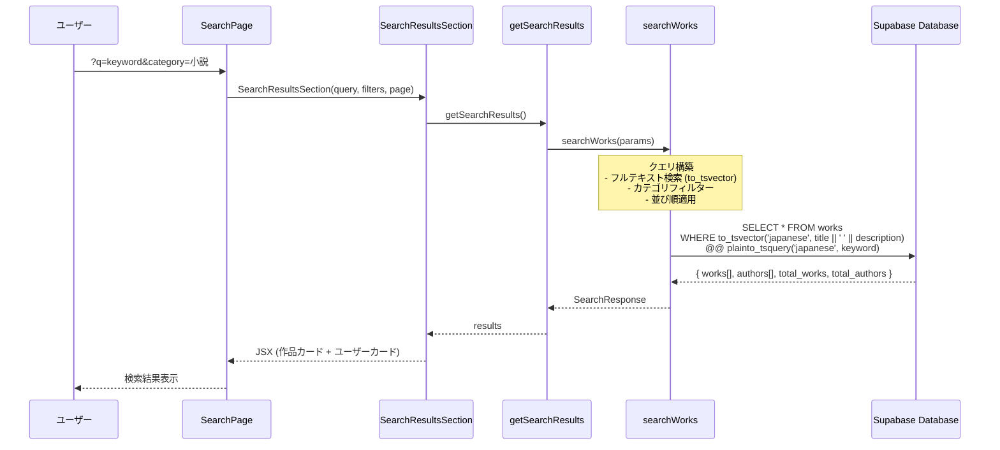

**検索処理:**
1. **フルテキスト検索**: PostgreSQLの`to_tsvector`で日本語対応
2. **カテゴリフィルター**: 小説/エッセイ/詩で絞り込み
3. **並び順**: 関連度（`ts_rank`）、閲覧数、いいね数、作成日時
4. **ページネーション**: 12件/ページ
5. **作者検索**: 同時にユーザー名検索も実行

---

### 5.5 UI部品（Leaf）

```mermaid
graph TD
    %% === Leaf Components ===
    subgraph EMPTY["leaf/EmptyResults.tsx"]
        EMPTY_F["EmptyResults()"]
    end

    subgraph PAGINATION["leaf/ResultsPagination.tsx"]
        PAGINATION_F["ResultsPagination()"]
    end

    subgraph RELATED["leaf/RelatedSearches.tsx"]
        RELATED_F["RelatedSearches()"]
    end

    subgraph SEARCH_INPUT["leaf/SearchInput.tsx"]
        SEARCH_INPUT_F["SearchInput()"]
    end

    subgraph FILTER_CHIPS["leaf/FilterChips.tsx"]
        FILTER_CHIPS_F["FilterChips()"]
    end

    subgraph SEARCH_TABS["leaf/SearchTabs.tsx"]
        SEARCH_TABS_F["SearchTabs()"]
    end

    %% === Next.js ===
    subgraph NEXT_LINK["next/link"]
        LINK["Link"]
    end

    %% === 依存関係 ===
    PAGINATION_F --> LINK
    RELATED_F --> LINK
    SEARCH_TABS_F --> LINK

    %% === スタイル ===
    classDef leaf fill:#27272a,stroke:#fde047,stroke-width:2px,color:#fff
    classDef npm fill:#450a0a,stroke:#ef4444,stroke-width:2px,color:#fff

    class EMPTY_F,PAGINATION_F,RELATED_F,SEARCH_INPUT_F,FILTER_CHIPS_F,SEARCH_TABS_F leaf
    class LINK npm
```

**主要Leaf:**
- **EmptyResults**: 検索結果0件時の表示
- **ResultsPagination**: ページネーションUI
- **RelatedSearches**: タグベースの関連検索提案
- **SearchInput**: 検索入力フィールド
- **FilterChips**: カテゴリ・並び順のチップUI
- **SearchTabs**: 全て/作品/ユーザーのタブ切り替え

---

## 6. ユーザープロフィールページ

**ファイルパス:** `app/app/profile/[id]/page.tsx`

### 6.1 全体構造（関数レベル）

```mermaid
graph TD
    %% === ページファイル ===
    subgraph PROFILE_PAGE["📄 app/app/profile/[id]/page.tsx"]
        USER_PROFILE_PAGE["UserProfilePage()"]
        GEN_META_P["generateMetadata()"]
    end

    %% === 認証ファイル ===
    subgraph AUTH_FILE["🔐 lib/auth.ts"]
        GET_AUTH_U["getAuthenticatedUser()"]
    end

    %% === Users Index (Public API) ===
    subgraph USERS_INDEX["📦 features/users/index.ts"]
        GET_USER_PROF["getUserProfile()"]
        CAN_VIEW_PROF["canViewProfile()"]
    end

    %% === Suspense Components ===
    subgraph FAST_PROF["⚙️ features/users/components/FastProfileSuspense.tsx"]
        FAST_PROF_FUNC["FastProfileSuspense()"]
    end

    subgraph USER_STATS["⚙️ features/users/components/UserStatsSuspense.tsx"]
        USER_STATS_FUNC["UserStatsSuspense()"]
    end

    subgraph USER_WORKS["⚙️ features/users/components/UserWorksSuspense.tsx"]
        USER_WORKS_FUNC["UserWorksSuspense()"]
    end

    subgraph FOLLOW_STATUS["⚙️ features/users/components/FollowStatusSuspense.tsx"]
        FOLLOW_STATUS_FUNC["FollowStatusSuspense()"]
    end

    %% === Users Server Loader ===
    subgraph USERS_LOADER["🔄 features/users/server/loader.ts"]
        GET_U_STATS["getUserStats()"]
        GET_U_WORKS["getUserWorks()"]
        GET_FOLLOW_REL["getFollowRelation()"]
        GET_U_PROFILE["getUserProfile() (internal)"]
    end

    %% === Shared Components ===
    subgraph SPINNER_FILE["🎨 components/shared/LoadingSpinner.tsx"]
        SPINNER_P["LoadingSpinner()"]
    end

    %% === Supabase Server ===
    subgraph SB_SERVER_P["🔧 lib/supabase/server.ts"]
        CREATE_CLIENT_P["createClient()"]
    end

    %% === Supabase Pool ===
    subgraph SB_POOL_P["💾 lib/supabase/pool.ts"]
        GET_SHARED_P["getSharedClient()"]
    end

    %% === React ===
    subgraph REACT_P["📦 react"]
        SUSPENSE_P["Suspense"]
        CACHE_P["cache()"]
    end

    %% === 依存関係（Page → Components） ===
    USER_PROFILE_PAGE --> GET_AUTH_U
    USER_PROFILE_PAGE --> GET_USER_PROF
    USER_PROFILE_PAGE --> CAN_VIEW_PROF
    USER_PROFILE_PAGE --> FAST_PROF_FUNC
    USER_PROFILE_PAGE --> USER_STATS_FUNC
    USER_PROFILE_PAGE --> USER_WORKS_FUNC
    USER_PROFILE_PAGE --> FOLLOW_STATUS_FUNC
    USER_PROFILE_PAGE --> SPINNER_P
    USER_PROFILE_PAGE --> SUSPENSE_P

    GEN_META_P --> GET_USER_PROF

    %% === Index → Loader ===
    GET_USER_PROF --> GET_U_PROFILE
    CAN_VIEW_PROF --> GET_U_PROFILE

    %% === Components → Loader ===
    USER_STATS_FUNC --> GET_U_STATS
    USER_WORKS_FUNC --> GET_U_WORKS
    FOLLOW_STATUS_FUNC --> GET_FOLLOW_REL

    %% === 認証 → Supabase ===
    GET_AUTH_U --> CREATE_CLIENT_P

    %% === Loader → Supabase ===
    GET_U_PROFILE --> CREATE_CLIENT_P
    GET_U_STATS --> CREATE_CLIENT_P
    GET_U_WORKS --> CREATE_CLIENT_P
    GET_FOLLOW_REL --> CREATE_CLIENT_P

    %% === Supabase Client Chain ===
    CREATE_CLIENT_P --> GET_SHARED_P
    GET_SHARED_P --> CACHE_P

    %% === スタイル ===
    classDef page fill:#1e293b,stroke:#0ea5e9,stroke-width:3px,color:#fff
    classDef auth fill:#0f172a,stroke:#10b981,stroke-width:2px,color:#fff
    classDef index fill:#1c1917,stroke:#a855f7,stroke-width:2px,color:#fff
    classDef component fill:#18181b,stroke:#f59e0b,stroke-width:2px,color:#fff
    classDef loader fill:#422006,stroke:#fbbf24,stroke-width:2px,color:#fff
    classDef sbServer fill:#171717,stroke:#22d3ee,stroke-width:2px,color:#fff
    classDef sbPool fill:#0c0a09,stroke:#84cc16,stroke-width:2px,color:#fff
    classDef npm fill:#450a0a,stroke:#ef4444,stroke-width:2px,color:#fff

    class USER_PROFILE_PAGE,GEN_META_P page
    class GET_AUTH_U auth
    class GET_USER_PROF,CAN_VIEW_PROF index
    class FAST_PROF_FUNC,USER_STATS_FUNC,USER_WORKS_FUNC,FOLLOW_STATUS_FUNC,SPINNER_P component
    class GET_U_STATS,GET_U_WORKS,GET_FOLLOW_REL,GET_U_PROFILE loader
    class CREATE_CLIENT_P sbServer
    class GET_SHARED_P sbPool
    class SUSPENSE_P,CACHE_P npm
```

### 6.2 認証・権限確認フロー

```mermaid
sequenceDiagram
    participant Page as 📄 UserProfilePage
    participant Auth as 🔐 getAuthenticatedUser
    participant Check as 🔍 canViewProfile
    participant Profile as 👤 getUserProfile

    Page->>Auth: 現在のユーザー取得
    Auth-->>Page: currentUser or null

    Page->>Profile: プロフィール取得(userId)
    Profile-->>Page: profileData

    Page->>Check: 閲覧権限確認(currentUser, profileData)

    alt プロフィールが公開 or 自分自身
        Check-->>Page: true
        Page->>Page: プロフィール表示
    else プロフィールが非公開 and 他人
        Check-->>Page: false
        Page->>Page: 非公開メッセージ表示
    end
```

---

## 7. 投稿ページ

**ファイルパス:** `app/app/post/page.tsx`

### 7.1 全体構造

```mermaid
graph TD
    %% === ページレイヤー ===
    subgraph "app/app/post/page.tsx"
        POST_PAGE["WorkCreatePage()"]
    end

    %% === 認証 ===
    subgraph "lib/auth.ts"
        GET_POST_USER["getPostUserProfile()"]
    end

    %% === データローダー ===
    subgraph "features/post/server/"
        LOADER["loader.ts<br/>getPostCreationData()"]
    end

    %% === Sections (大画面ブロック) ===
    subgraph "features/post/sections/"
        BASIC["WorkCreateBasicSection"]
        MEDIA["WorkCreateMediaSection"]
        CONTENT["WorkCreateContentSection"]
        SETTINGS["WorkCreateSettingsSection"]
        PREVIEW["WorkCreatePreviewSection"]
        DRAFT["WorkCreateDraftSection"]
    end

    %% === Supabase ===
    subgraph "lib/supabase/"
        SB["createClient()"]
    end

    %% === 依存関係 ===
    POST_PAGE --> GET_POST_USER
    POST_PAGE --> LOADER
    POST_PAGE --> BASIC
    POST_PAGE --> MEDIA
    POST_PAGE --> CONTENT
    POST_PAGE --> SETTINGS
    POST_PAGE --> PREVIEW
    POST_PAGE --> DRAFT

    GET_POST_USER --> SB
    LOADER --> SB

    %% === スタイル ===
    classDef page fill:#1e293b,stroke:#0ea5e9,stroke-width:3px,color:#fff
    classDef auth fill:#0f172a,stroke:#10b981,stroke-width:2px,color:#fff
    classDef loader fill:#0c0a09,stroke:#84cc16,stroke-width:2px,color:#fff
    classDef section fill:#1c1917,stroke:#a855f7,stroke-width:2px,color:#fff
    classDef lib fill:#171717,stroke:#22d3ee,stroke-width:2px,color:#fff

    class POST_PAGE page
    class GET_POST_USER auth
    class LOADER loader
    class BASIC,MEDIA,CONTENT,SETTINGS,PREVIEW,DRAFT section
    class SB lib
```

### 7.2 UI部品（Leaf）依存関係

```mermaid
graph TD
    %% === Sections ===
    subgraph Sections["sections/"]
        BASIC_SEC["WorkCreateBasicSection"]
        MEDIA_SEC["WorkCreateMediaSection"]
        CONTENT_SEC["WorkCreateContentSection"]
        SETTINGS_SEC["WorkCreateSettingsSection"]
    end

    %% === Leaf Components ===
    subgraph Leaf["leaf/"]
        CAT_SELECT["CategorySelect"]
        TAG_INPUT["TagInput"]
        SERIES_SELECT["SeriesSelector"]
        IMAGE_UPLOAD["ImageUpload"]
        IMAGE_CROP["ImageCropper"]
        RICH_EDITOR["RichTextEditor"]
        PROOF["ProofreadingPanel"]
        PUBLISH_OPT["PublishingOptions"]
        CONTEXT_MENU["ContextMenu"]
    end

    %% === 依存関係 ===
    BASIC_SEC --> CAT_SELECT
    BASIC_SEC --> TAG_INPUT
    BASIC_SEC --> SERIES_SELECT

    MEDIA_SEC --> IMAGE_UPLOAD
    MEDIA_SEC --> IMAGE_CROP

    CONTENT_SEC --> RICH_EDITOR
    CONTENT_SEC --> PROOF
    CONTENT_SEC --> CONTEXT_MENU

    SETTINGS_SEC --> PUBLISH_OPT

    %% === スタイル ===
    classDef section fill:#1c1917,stroke:#a855f7,stroke-width:2px,color:#fff
    classDef leaf fill:#18181b,stroke:#f59e0b,stroke-width:2px,color:#fff

    class BASIC_SEC,MEDIA_SEC,CONTENT_SEC,SETTINGS_SEC section
    class CAT_SELECT,TAG_INPUT,SERIES_SELECT,IMAGE_UPLOAD,IMAGE_CROP,RICH_EDITOR,PROOF,PUBLISH_OPT,CONTEXT_MENU leaf
```

### 7.3 データフロー

```mermaid
sequenceDiagram
    participant User as 👤 ユーザー
    participant Page as 📄 WorkCreatePage
    participant Auth as 🔐 getPostUserProfile
    participant Loader as 🔄 getPostCreationData
    participant DB as 🗄️ Database

    User->>Page: 投稿ページアクセス
    Page->>Auth: プロフィール取得
    Auth->>DB: auth.getUser()
    DB-->>Auth: User + Profile
    Auth-->>Page: user

    Page->>Loader: データ取得(userId, username)

    Note over Loader: Promise.all()で並列取得

    par シリーズ取得
        Loader->>DB: SELECT * FROM series<br/>WHERE user_id = xxx
        DB-->>Loader: series[]
    and 下書き取得
        Loader->>DB: SELECT * FROM works<br/>WHERE user_id = xxx<br/>AND status = 'draft'
        DB-->>Loader: drafts[]
    end

    Loader-->>Page: { series, drafts }
    Page-->>User: フォーム表示
```

**主要データ取得:**
- **シリーズ一覧**: ユーザーが作成した既存シリーズ
- **下書き一覧**: 未公開の作品

---

## 8. トレンドページ

**ファイルパス:** `app/app/trends/page.tsx`

### 8.1 全体構造

```mermaid
graph TD
    %% === ページレイヤー ===
    subgraph "app/app/trends/page.tsx"
        TRENDS_PAGE["TrendsPage()"]
    end

    %% === Sections ===
    subgraph "features/trends/sections/"
        MAIN["TrendPageSection"]
        HERO["TrendHeroSection"]
        TAGS["TrendTagsSection"]
        TRENDING["TrendingWorksSection"]
        WORKS_RANK["WorksRankingSection"]
        USERS_RANK["UsersRankingSection"]
    end

    %% === Shared Components ===
    subgraph "components/shared/"
        SPINNER["LoadingSpinner"]
    end

    %% === React ===
    subgraph "react"
        SUSPENSE["Suspense"]
    end

    %% === 依存関係 ===
    TRENDS_PAGE --> SUSPENSE
    TRENDS_PAGE --> SPINNER
    TRENDS_PAGE --> MAIN

    MAIN --> HERO
    MAIN --> TAGS
    MAIN --> TRENDING
    MAIN --> WORKS_RANK
    MAIN --> USERS_RANK

    %% === スタイル ===
    classDef page fill:#1e293b,stroke:#0ea5e9,stroke-width:3px,color:#fff
    classDef section fill:#1c1917,stroke:#a855f7,stroke-width:2px,color:#fff
    classDef comp fill:#18181b,stroke:#f59e0b,stroke-width:2px,color:#fff
    classDef npm fill:#450a0a,stroke:#ef4444,stroke-width:2px,color:#fff

    class TRENDS_PAGE page
    class MAIN,HERO,TAGS,TRENDING,WORKS_RANK,USERS_RANK section
    class SPINNER comp
    class SUSPENSE npm
```

### 8.2 データローダー構造

```mermaid
graph TD
    subgraph "features/trends/server/"
        LOADER["loader.ts"]
        WORK_Q["workQueries.ts"]
        USER_Q["userQueries.ts"]
        TREND_Q["trendQueries.ts"]
    end

    subgraph "Functions"
        GET_TREND_WORKS["getTrendingWorks()"]
        GET_WORKS_RANK["getWorksRanking()"]
        GET_USERS_RANK["getUsersRanking()"]
        GET_TREND_TAGS["getTrendTags()"]
        GET_HERO["getHeroBanners()"]
        GET_ANNOUNCE["getAnnouncements()"]
    end

    subgraph "lib/supabase/"
        CLIENT["createClient()"]
    end

    %% === 依存関係 ===
    LOADER --> WORK_Q
    LOADER --> USER_Q
    LOADER --> TREND_Q

    WORK_Q --> GET_TREND_WORKS
    WORK_Q --> GET_WORKS_RANK
    USER_Q --> GET_USERS_RANK
    TREND_Q --> GET_TREND_TAGS
    TREND_Q --> GET_HERO
    TREND_Q --> GET_ANNOUNCE

    GET_TREND_WORKS --> CLIENT
    GET_WORKS_RANK --> CLIENT
    GET_USERS_RANK --> CLIENT
    GET_TREND_TAGS --> CLIENT
    GET_HERO --> CLIENT
    GET_ANNOUNCE --> CLIENT

    %% === スタイル ===
    classDef loader fill:#0c0a09,stroke:#84cc16,stroke-width:2px,color:#fff
    classDef func fill:#422006,stroke:#fbbf24,stroke-width:2px,color:#fff
    classDef lib fill:#171717,stroke:#22d3ee,stroke-width:2px,color:#fff

    class LOADER,WORK_Q,USER_Q,TREND_Q loader
    class GET_TREND_WORKS,GET_WORKS_RANK,GET_USERS_RANK,GET_TREND_TAGS,GET_HERO,GET_ANNOUNCE func
    class CLIENT lib
```

### 8.3 UI部品（Leaf）

```mermaid
graph TD
    subgraph Sections["sections/"]
        MAIN_SEC["TrendPageSection"]
        TAGS_SEC["TrendTagsSection"]
    end

    subgraph Leaf["leaf/"]
        TABS["TrendTabs"]
        BANNER["HeroBanner"]
        TAG_CHIP["TrendTagChip"]
    end

    %% === 依存関係 ===
    MAIN_SEC --> TABS
    MAIN_SEC --> BANNER
    TAGS_SEC --> TAG_CHIP

    %% === スタイル ===
    classDef section fill:#1c1917,stroke:#a855f7,stroke-width:2px,color:#fff
    classDef leaf fill:#18181b,stroke:#f59e0b,stroke-width:2px,color:#fff

    class MAIN_SEC,TAGS_SEC section
    class TABS,BANNER,TAG_CHIP leaf
```

**特徴:**
- **静的生成**: ISR（Incremental Static Regeneration）使用、5分ごとに再生成
- **認証不要**: 公開ページ

---

## 9. 認証ページ

### 9.1 ログイン・サインアップページ

**ファイルパス:** `app/auth/login/page.tsx`, `app/auth/signup/page.tsx`

```mermaid
graph TD
    %% === ログインページ ===
    subgraph "app/auth/login/page.tsx"
        LOGIN_PAGE["LoginPage()"]
    end

    %% === サインアップページ ===
    subgraph "app/auth/signup/page.tsx"
        SIGNUP_PAGE["SignupPage()"]
    end

    %% === Sections ===
    subgraph "features/auth/sections/"
        LOGIN_FORM["LoginFormSection"]
        SIGNUP_FORM["SignupFormSection"]
        FORGOT_FORM["ForgotPasswordForm"]
        RESET_FORM["ResetPasswordForm"]
    end

    %% === 依存関係 ===
    LOGIN_PAGE --> LOGIN_FORM
    SIGNUP_PAGE --> SIGNUP_FORM

    %% === スタイル ===
    classDef page fill:#1e293b,stroke:#0ea5e9,stroke-width:3px,color:#fff
    classDef section fill:#1c1917,stroke:#a855f7,stroke-width:2px,color:#fff

    class LOGIN_PAGE,SIGNUP_PAGE page
    class LOGIN_FORM,SIGNUP_FORM,FORGOT_FORM,RESET_FORM section
```

### 9.2 UI部品（Leaf）依存関係

```mermaid
graph TD
    %% === Sections ===
    subgraph Sections["sections/"]
        LOGIN_SEC["LoginFormSection"]
        SIGNUP_SEC["SignupFormSection"]
    end

    %% === Leaf Components ===
    subgraph Leaf["leaf/"]
        FORM_FIELD["FormField"]
        PASSWORD_INPUT["PasswordInput"]
        SOCIAL_BTN["SocialLoginButton"]
    end

    %% === 依存関係 ===
    LOGIN_SEC --> FORM_FIELD
    LOGIN_SEC --> PASSWORD_INPUT
    LOGIN_SEC --> SOCIAL_BTN

    SIGNUP_SEC --> FORM_FIELD
    SIGNUP_SEC --> PASSWORD_INPUT
    SIGNUP_SEC --> SOCIAL_BTN

    %% === スタイル ===
    classDef section fill:#1c1917,stroke:#a855f7,stroke-width:2px,color:#fff
    classDef leaf fill:#18181b,stroke:#f59e0b,stroke-width:2px,color:#fff

    class LOGIN_SEC,SIGNUP_SEC section
    class FORM_FIELD,PASSWORD_INPUT,SOCIAL_BTN leaf
```

### 9.3 認証フロー（Server Actions）

```mermaid
sequenceDiagram
    participant User as 👤 ユーザー
    participant Form as 📝 LoginFormSection
    participant Action as ⚡ loginAction
    participant Schema as 📋 loginSchema (Zod)
    participant Supabase as ☁️ Supabase Auth
    participant DB as 🗄️ Database

    User->>Form: メール・パスワード入力
    User->>Form: フォーム送信
    Form->>Action: loginAction(formData)

    Action->>Schema: safeParse(rawFormData)

    alt バリデーション成功
        Schema-->>Action: { success: true, data }
        Action->>Supabase: auth.signInWithPassword()

        alt ログイン成功
            Supabase->>DB: ユーザー情報取得
            DB-->>Supabase: user data
            Supabase-->>Action: { user, session }
            Action-->>Form: redirect('/')
            Form-->>User: ホームページへ
        else ログイン失敗
            Supabase-->>Action: { error }
            Action-->>Form: { errors }
            Form-->>User: エラーメッセージ表示
        end
    else バリデーション失敗
        Schema-->>Action: { success: false, error }
        Action-->>Form: { errors }
        Form-->>User: エラーメッセージ表示
    end
```

**主要Server Actions:**
- `loginAction()`: ログイン処理
- `signupAction()`: サインアップ処理
- `forgotPasswordAction()`: パスワードリセットメール送信

**バリデーション（Zod Schemas）:**
- `loginSchema`: メール・パスワード検証
- `signupSchema`: ユーザー名・メール・パスワード・生年月日・利用規約同意検証
- `forgotPasswordSchema`: メールアドレス検証

---

## 10. Feature内部構造

### 10.1 works機能

**ディレクトリ:** `features/works/`

```mermaid
graph TD
    %% === Public API ===
    subgraph Public["features/works/index.ts"]
        INDEX["export"]
    end

    %% === Server Layer ===
    subgraph Server["server/"]
        LOADER["loader.ts"]
        ACTIONS["actions.ts"]
        READING["reading.ts"]
        CREATION["creation.ts"]
    end

    %% === Sections (大画面ブロック) ===
    subgraph Sections["sections/"]
        BASIC["WorkBasicInfo"]
        CONTENT["WorkContentWithProgress"]
        ACTIONS_UI["WorkUserActions"]
        COMMENTS["WorkDetailCommentsSection"]
    end

    %% === Leaf (小UI部品) ===
    subgraph Leaf["leaf/"]
        BOOKMARK_BTN["BookmarkFloatingButton"]
        LIKE_BTN["LikeButton"]
        SHARE_BTN["ShareButton"]
    end

    %% === Schema & Types ===
    subgraph Schema["schemas.ts & types.ts"]
        SCHEMAS["Zod Schemas"]
        TYPES["TypeScript Types"]
    end

    %% === 依存関係 ===
    INDEX --> LOADER
    INDEX --> ACTIONS
    INDEX --> BASIC
    INDEX --> CONTENT
    INDEX --> SCHEMAS
    INDEX --> TYPES

    BASIC --> TYPES
    CONTENT --> READING
    CONTENT --> TYPES

    ACTIONS_UI --> ACTIONS
    ACTIONS_UI --> LIKE_BTN
    ACTIONS_UI --> BOOKMARK_BTN
    ACTIONS_UI --> SHARE_BTN

    COMMENTS --> ACTIONS

    LOADER --> TYPES
    ACTIONS --> SCHEMAS
    READING --> TYPES

    %% === スタイル ===
    classDef publicStyle fill:#1e293b,stroke:#0ea5e9,stroke-width:3px,color:#fff
    classDef serverStyle fill:#0c0a09,stroke:#84cc16,stroke-width:2px,color:#fff
    classDef sectionStyle fill:#1c1917,stroke:#a855f7,stroke-width:2px,color:#fff
    classDef leafStyle fill:#18181b,stroke:#f59e0b,stroke-width:2px,color:#fff
    classDef schemaStyle fill:#171717,stroke:#22d3ee,stroke-width:2px,color:#fff

    class INDEX publicStyle
    class LOADER,ACTIONS,READING,CREATION serverStyle
    class BASIC,CONTENT,ACTIONS_UI,COMMENTS sectionStyle
    class BOOKMARK_BTN,LIKE_BTN,SHARE_BTN leafStyle
    class SCHEMAS,TYPES schemaStyle
```

**構造ルール:**
- **server/**: データ取得・操作ロジック
- **sections/**: 大きな画面ブロック（200行以内）
- **leaf/**: 小さなUI部品（150行以内）
- **schemas.ts**: Zodバリデーション
- **types.ts**: TypeScript型定義
- **index.ts**: 外部公開API

---

## 図の見方

### 色分け

| 色 | レイヤー | 説明 | 例 |
|---|---|---|---|
| **🔵 青** | Page | Next.js App Routerページ | `HomePage()` |
| **🟢 緑** | Auth | 認証レイヤー | `getAuthenticatedUser()` |
| **🟠 オレンジ** | Component | 共通UI部品 | `LoadingSpinner` |
| **🟣 紫** | Feature | ドメイン機能コンポーネント | `ContinueReadingSuspense` |
| **🔷 シアン** | Lib | Supabaseクライアント（server.ts） | `createClient()` |
| **🟩 ライム** | Server | サーバープール（pool.ts） | `getSharedClient()` |
| **🟡 黄** | Util | ユーティリティ関数 | `cn()`, `formatDistanceToNow()` |
| **🔴 赤** | NPM | 外部npmパッケージ | `@supabase/ssr`, `clsx`, `twMerge` |
| **💙 明青** | Next.js | Next.js公式API | `next/headers` |

### 階層ルール

1. **Page** (200-300行): ルーティング・認証確認
2. **Section** (200行以内): 大きな画面ブロック
3. **Leaf** (150行以内): 小さなUI部品

### 命名規則

- 機能接頭辞: `Work*`, `User*`, `Search*`
- Section: `*Section`
- Leaf: `*Button`, `*Card`, `*Badge`等

---

## 開発時の注意点

1. **依存の向き**: 上位レイヤー → 下位レイヤーのみ
2. **再利用**: 3回以上で共通化検討
3. **分割基準**: 250行超えたら分割
4. **キャッシュ**: `lib/cache.ts`のタグ関数で統一
5. **スタイル**: 8割TailwindCSS直書き、2割CSS化
